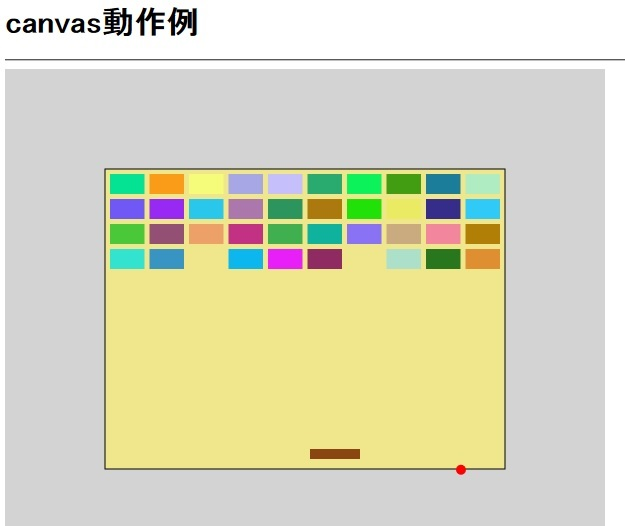

# 中間発表 #

## HTML5の新機能とそのデモ ##

###__canvasタグ__

HTML5で追加されたタグの中でcanvasタグに着目した。  
プラグイン等の外部ソフトを使用せず、htmlだけで画像などを描画することができる。  
線や円、四角形や円弧、また塗りつぶし等が可能である。  
現段階でcanvasタグとjavascriptを利用してサンプルを作成した。

___
### メリット 

- 外部ソフトを使う必要がない
- 細かい修正が簡単に行える  
- 画像を使用せずに描画をする際に容易になる(画像の準備、処理の速度)  

___
### デメリット 

- 知識が必要
- 場合によっては外部ソフトのほうが作成しやすい  

___
### 今後の展開 

####1)_その他の機能を使って性能の強化  
canvasタグに限らずHTML5のその他の機能やPHPの通信機能等を使ってより機能性の高いものを作成  
そのためcanvas以外のほかの機能も使い説明できるようにする  

####2)_canvasを使用してHTML5に追加された機能の説明
当初のテーマに沿ってHTML5の機能を説明する。  
視覚的にわかりやすいようにHTML5の違いやメリットを説明できるようにする。  
さらにcanvasの表示について身に着ける。

