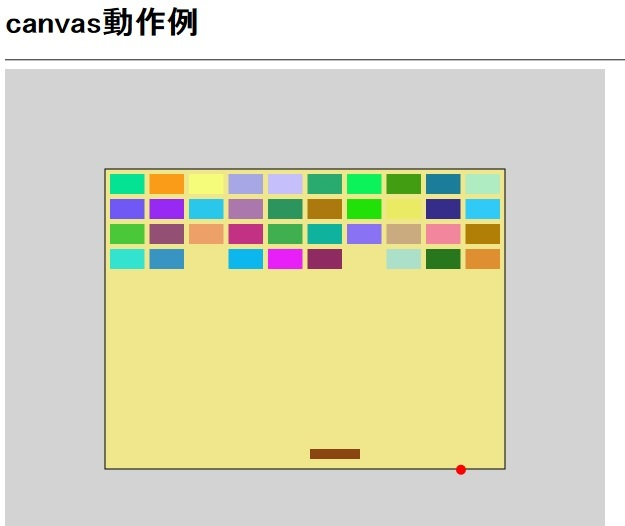
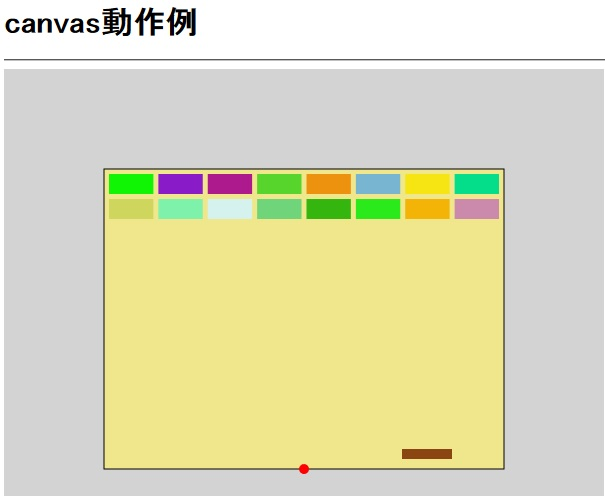

<!--

-->

#canvasタグ  

##____canvas____
html5において追加されたタグ  
プラグイン等の外部ソフトを使用せず、htmlだけで画像などを描画することができる。   
線や円、四角形や円弧、また塗りつぶし等も可能である。  
さらに、図形における影やグラデーションも設定可能。
Javascriptを利用すれば下載のような簡単なゲームも作成可能。

##__コマンド例__

__※ctxはcanvas要素のノードオブジェクト__   

* _ctx.beginPath();_  
描画を始める宣言
* _ctx.moveTo(20, 20);_  
線の開始点を設定(x座標20、y座標20の位置に設定)
* _ctx.lineTo(120, 20)_  
線の終了点を設定(前回座標から今回座標まで線を引く)
* _ctx.closePath();_  
書いた線を閉じる(これが宣言されるまで線を引き続ける)
* _ctx.stroke();_  
書いた図を線で描画する  
* _ctx.fill();_  
書いた図の内側を塗りつぶして描画する  
－－－－－－－－－－－－－
* _ctx.strokeRect(10,20,30,40);_  
開始点x:10y:20、幅30、高さ40の四角形の枠を描く
* _ctx.fillRect(10,20,30,40);_  
開始点x:10y:20、幅30、高さ40の塗りつぶされた四角形を描く
* _ctx.arc(10,20,5,0,Math.PI*2,true);_  
座標x:10y:20を中心に半径5の円を描く。開始点は0、終了点はMath.PI\*2()
* _ctx.clearRect(10, 20, 30, 40);_  
範囲内の描画を消去する。  
－－－－－－－－－－－－－－  
* _ctx.fillStyle = 'rgba(192, 80, 77, 0.7)';_  
塗りつぶしの色を設定する(red:192,green:80,blue:77,透明度0.7)  

##__実際の使用例__
ブロック崩し(brockbreak.html)

* 動作範囲の設定(ベージュのエリア)  
ｰ枠に接触すると球が反射する  
ｰ下部の枠に接触すると球がストップ  
* 破壊ブロックの設定(上部のカラフルブロック)  
ｰ球が接触すると消滅  
ｰ球のあたる面によって反射角度を変える  
ｰ読み込むたびにランダムで配色  
ｰ指定された変数を変更することで行列数を変更可能
* 反射棒の設定(下部の茶色の棒状のもの)  
ｰマウスカーソルを追従して動作  
ｰ球が当たるとy軸方向に反射  
ｰ変数により棒の長さが変更可能  
* 球の設定(ベージュ枠沿いの赤丸)  
ｰ変数により球の大きさを変更  
ｰ壁、ブロック、反射棒に接触すると反射  
ｰ下部の枠にあたるとストップ  
ｰ反射時に速度・角度をランダムで変更

##__前バージョンとの比較__

* ブロックを画像として扱わないため、単調なものの場合画像を用意する必要がない  
* カラーリング、大きさ等も自由に変更可能
* 画像等を用意しないため処理が速くなる(かも)
* 数値(図の大きさ等)を比較的簡単に変更できる

##__その他__
* canvasとは離れるがマルチデバイス化？(スマホで表示とか)